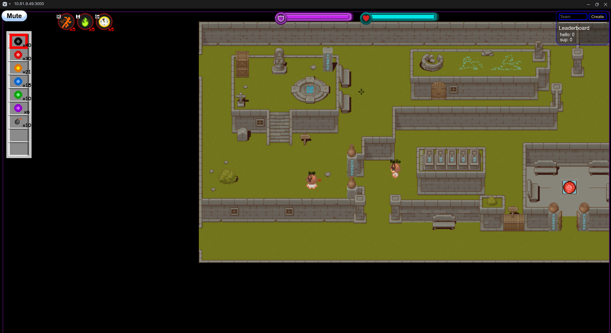
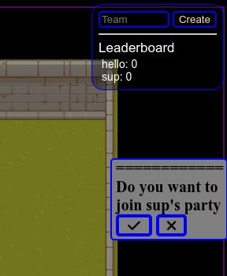
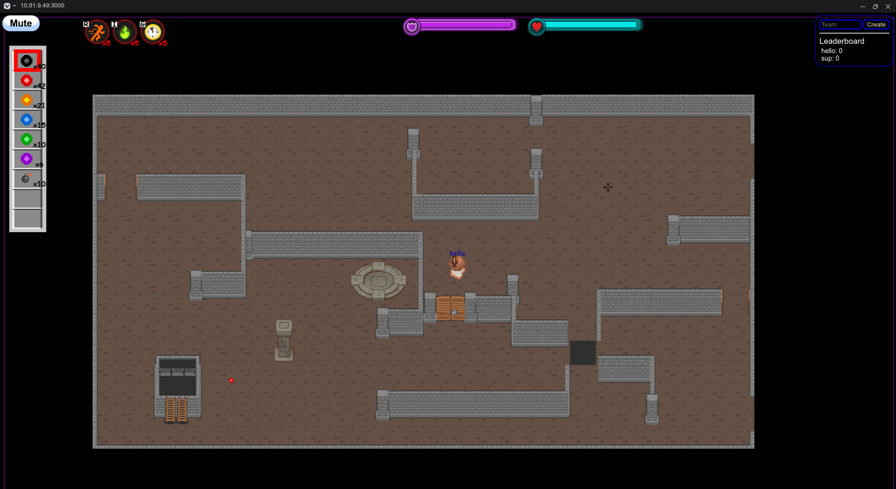

<pre>
   Initializing =>
   

   git clone -b remastered https://github.com/rajeev-k47/Rootr.git
   cd 2D-multiplayer-battle-and-fun-game
   npm i
   node app.js

   App will host on respected ip:-/

</pre>

## Samples :

  (TIPS):
  
   Use w,a,s,d standard keys to move the player.  
   You can use left toolbar as weapon store and shoot them by clicking on the opponent. 
   Use the R,I keys on keyboard for increasing speed and Invisibility respectively. 
   Use the doors to navigate through the rooms of map . 
   Use shift key to Sheild up. 
   Use Healing pad for healing the health of player and Shield (Both have different health and different healing pad). 
   Use team feature on top right corner to make a new team and invite members using clicking on their username .
   

   
   
   

  Report me bugs related to game on runnerofficial00@gmail.com
